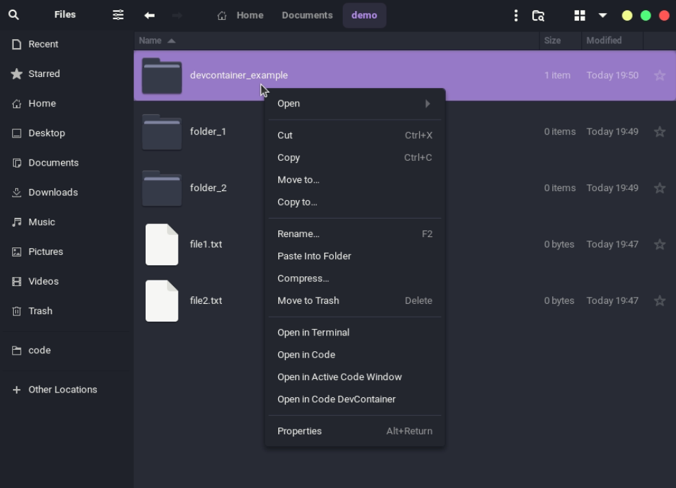
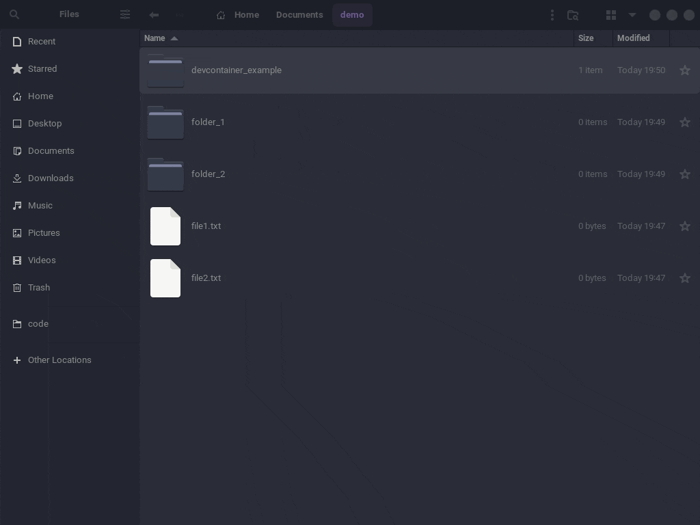
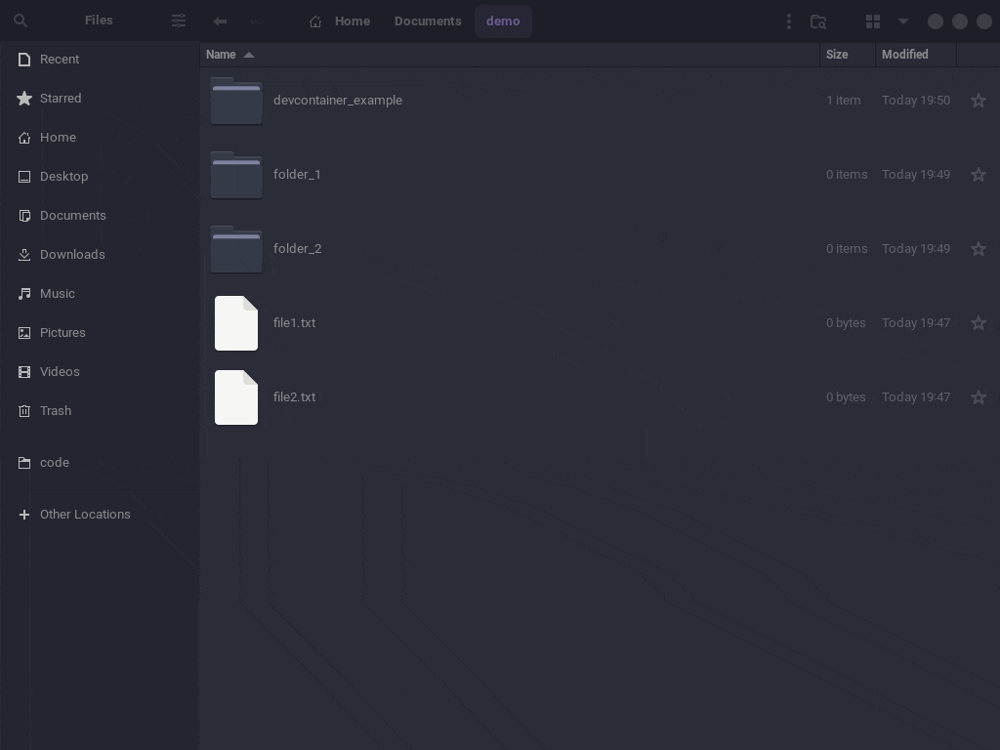

# About

Adds an option in Nautilus context menu to "Open in VSCode"
* Support for opening VSCode in a devcontainer (if .devcontainer/devcontainer.json exists)
* Support for multiple folders
* Support for files

## Install Extension

```
wget -qO- https://raw.githubusercontent.com/harry-cpp/code-nautilus/master/install.sh | bash
```

This will install `code-nautilus.py` to `~/.local/share/nautilus-python/extensions/code-nautilus.py`.
If you intend to make changes to this file then ensure that you 
```bash
nautilus -q
```

## Uninstall Extension

```
rm -f ~/.local/share/nautilus-python/extensions/code-nautilus.py
```

# Examples
DevContainer


Open file - Use Active Window


Multiple files and folders

